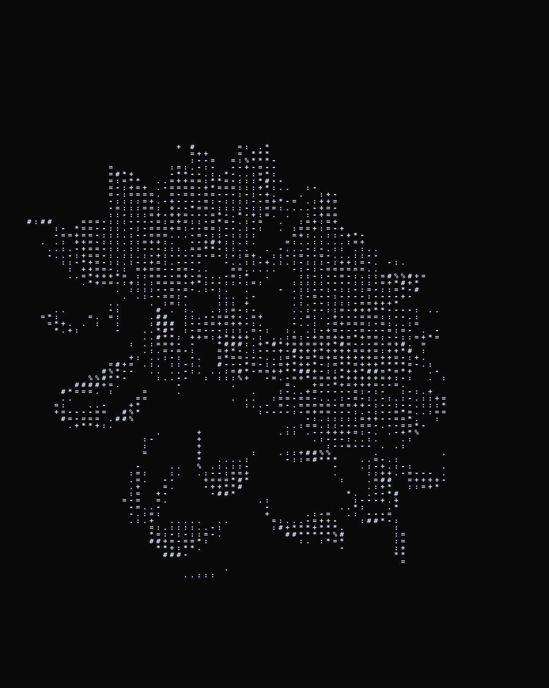

# 📦 picture of symbols (POS) - ASCII Art Generator (Python + Pillow)

This script converts images into ASCII art with optional color support, using a customizable gradient of characters. You can choose color modes, font size, background color, and other options.

## 📜 Dependencies

- Python 3.10+
- [Pillow](https://pypi.org/project/Pillow/)

To install Pillow:
```bash
pip install pillow
```

## 📋 Function Description

```python
generate(
    img_dir: str, 
    font: str, 
    color: tuple[int, int, int] | list[tuple[int, int, int]] = None, 
    background_color: tuple[int] = (0,0,0), 
    font_size: int = 16, 
    bright_limit: int = 0, 
    size_multiplier: int = 1,
    grad: str = " .:-=+*#%@"
) -> Image
```

### 📌 Parameters:

| Parameter         | Type                                   | Description |
|:------------------|:---------------------------------------|:----------------|
| `img_dir`           | `str`                                    | Path to the source image |
| `font`              | `str`                                    | Path to a `.ttf` font file |
| `color`             | `tuple[int, int, int]` or `list[tuple[int, int, int]]` or `None` | Color of the characters: can be a single color, a list of colors, or `None` (to use the original image pixel color) |
| `background_color`  | `tuple[int, int, int]`                  | Background color of the result image |
| `font_size`         | `int`                                    | Font size for the ASCII characters |
| `bright_limit`      | `int`                                    | Number of spaces at the start of the gradient (to control minimum brightness shown as symbols) |
| `size_multiplier`   | `int`                                    | Image scaling factor |
| `grad`              | `str`                                    | A string of characters from lightest to darkest |

### 📌 Returns:

- A new `PIL.Image` object containing the ASCII art image.

## 📊 How It Works

1. Opens the source image.
2. Calculates the brightness of each pixel using:
   ```
   0.299 * R + 0.587 * G + 0.114 * B
   ```
3. Selects a character from the gradient string based on brightness.
4. Draws the character onto a new image with the selected color.
5. Returns the generated image.

## 📷 Example Usage:

```python
from POS import generate

img = generate(
    img_dir = "img.png",
    font = "DejaVuSansMono-Bold.ttf",
    font_size = 18,
    color = (230, 230, 255),
    background_color = (10, 10, 10),
    bright_limit = 10,
    size_multiplier = 2,
)

img.save("result.png")
```
<center>
  
  
</center>
